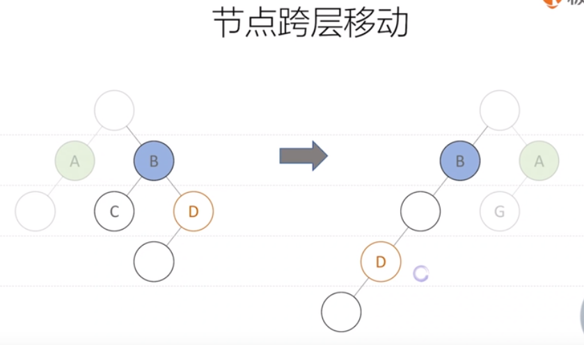

### 浏览器页面渲染过程

大概分成几个步骤：
1. 解析HTML文本并构建DOM tree
2. 解析CSS样式表并构建CSSOM tree
3. 根据DOM tree 和 CSSOM tree 构建 Render tree
4. 根据Render tree信息进行&布局处理（Layout）
5. 对页面元素进行绘制（Painting）


### Prototype原型
Prototype是JavaScript中的对象的一个特殊的内置属性，就是对于其它对象的引用。几乎所有的对象在创建时[[Prototype]]都会被赋予一个非空的值。  


### React Diff算法
广度优先
节点跨层移动


### Arguments

arguments是传递给函数的参数的类数组对象；

类似于数组，但是只有length属性，没有其它数组的属性

### JS new的过程

new 创建一个对象类型的实例/或者具有构造函数的内置对象的实例（函数实例化）

```javascript
//eg:
function Base () {
    this.name = 'Henryk';
}
var a = new Base(); //a
```

创建对象实例的过程：

1.创建一个新对象（a）

2.将新对象（a）的`__proto__`指向构造函数（Base）的prototype对象

3.将构造函数的作用域赋值给新对象（Base的this指向新对象a）

4.执行构造函数中的代码（定义属性：Base中的this.name，为新对象添加属性）

5.返回新对象（a）


